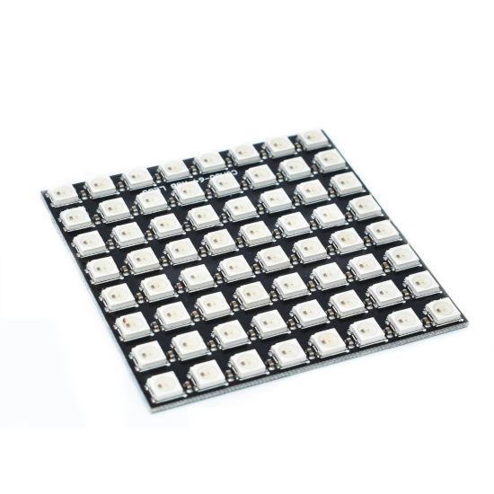

 rpi ws2812 controller
==========
### Description
Raspberry Pi kernel module for controlling ws2812 led 8*8 matrix.
Additionally, user-space application was implemented for the testing.

### Author
    Oleksandr Sahaidachnyi, Kharkiv

---

Purpose of development is to consolidate gained knowledge.

Technical equipment:

    1. Raspberry Pi Zero
    2. CJMCU 64 WS2812 RGB LED MATRIX

### GPIO (SPI) Usage:
    GPIO10 - SPI0-MOSI to transfer data from driver to matrix
    GPIO11 - SPI0-SCLK 

### References

WS2812 [pdf](references/WS2812.pdf)
