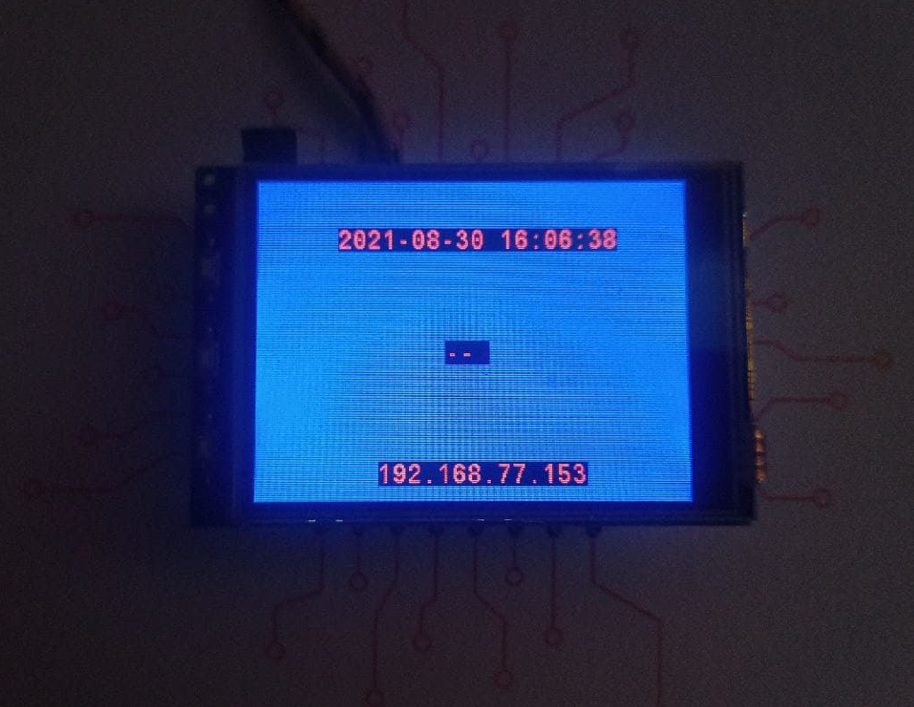
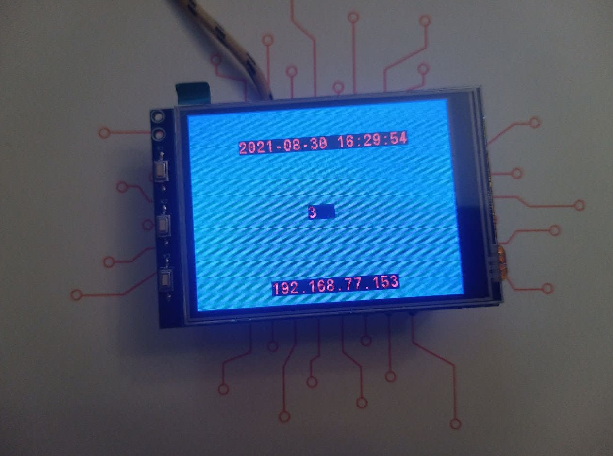
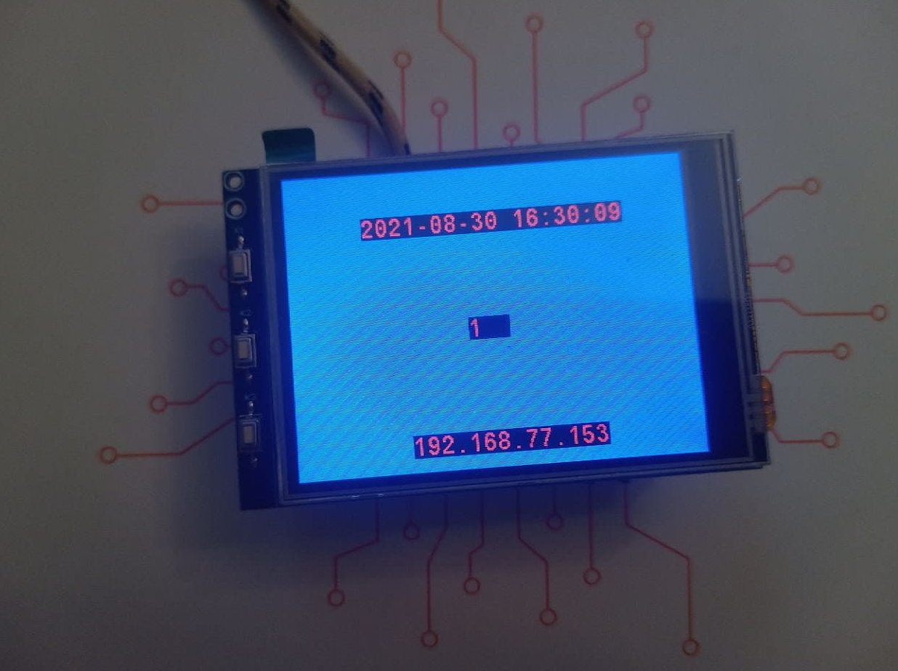
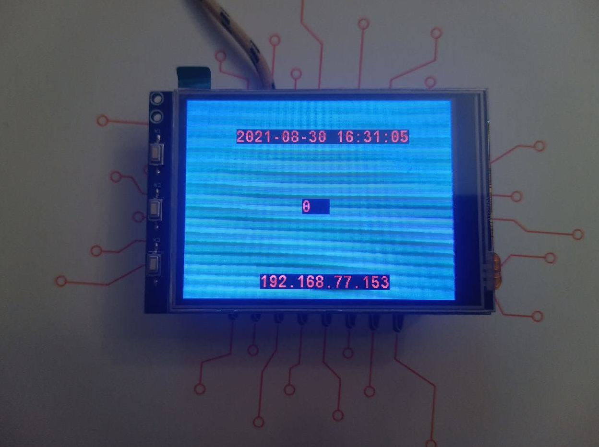
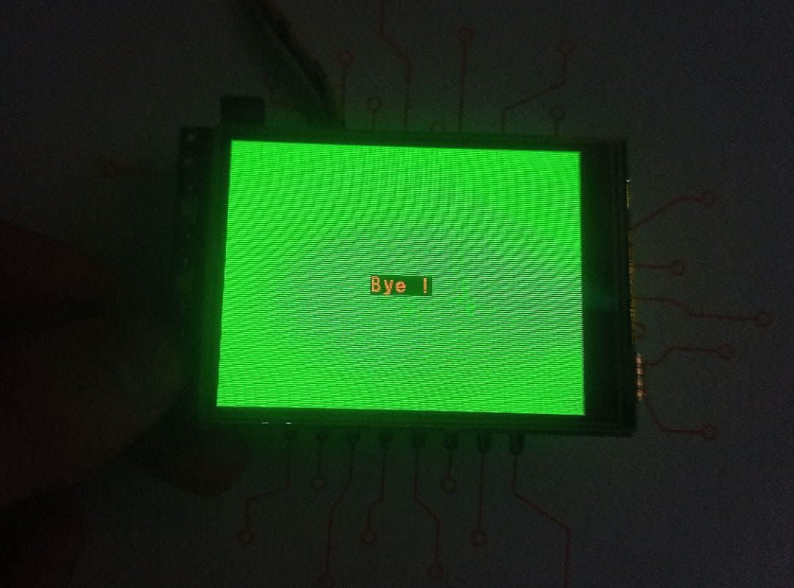
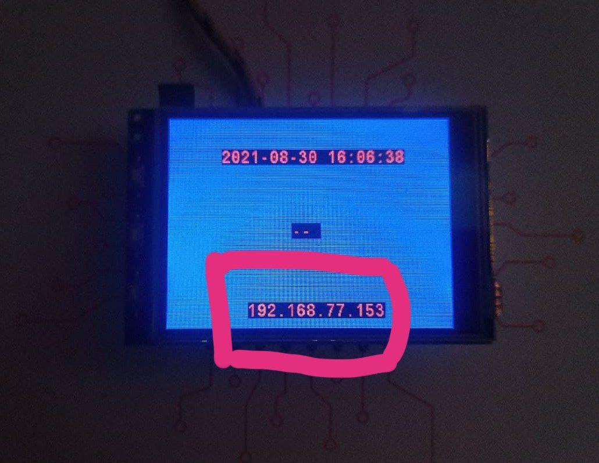
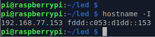

# Task04
[Task #4](https://gl-khpi.gitlab.io/task04/).
Отображение данных на LCD дисплее.

# Demo (Счетчик)

1. Экран до нажатия кнопок:

2. Экран после **трехкратного** нажатия кнопки **X1**:

3. Экран после **двухкратного** нажатия кнопки **X3**:

4. Экран после **краткого** нажатия кнопки **X2**:

4. Экран после **длительного** нажатия кнопки **X2**:

---
## IP адрес
1. IP адрес на экране:

2. Реальный IP адрес в консоли:

